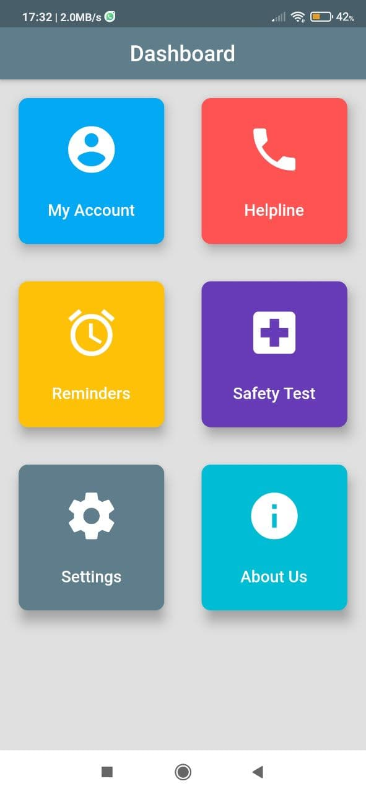
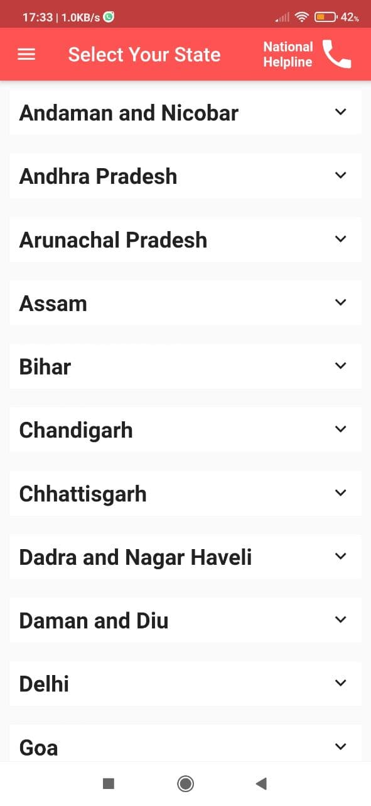
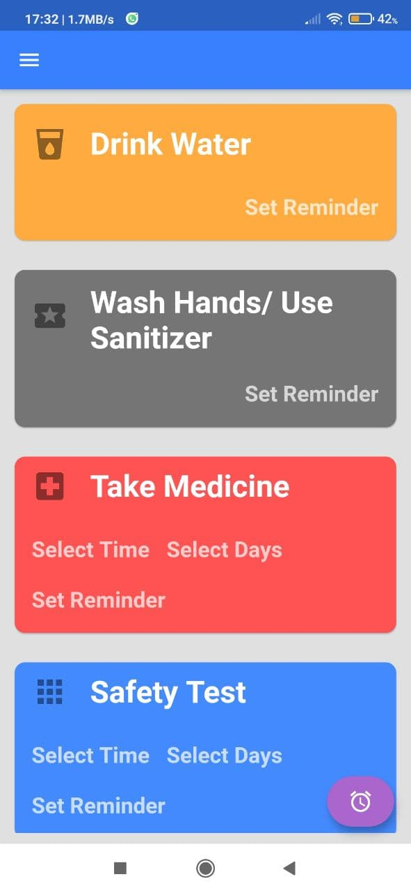
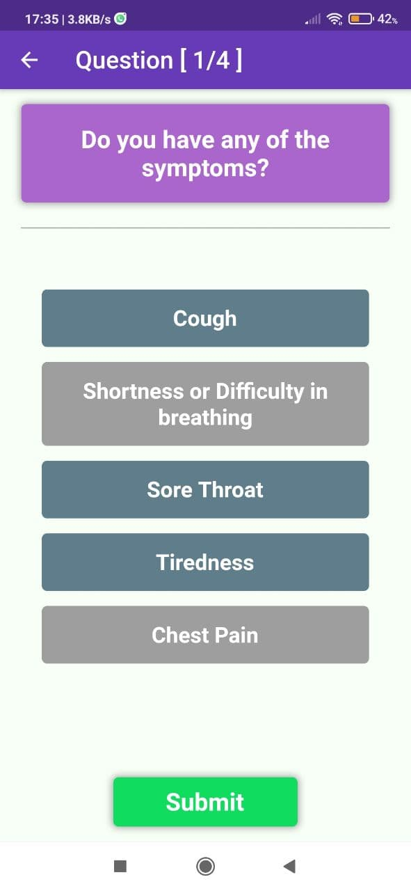
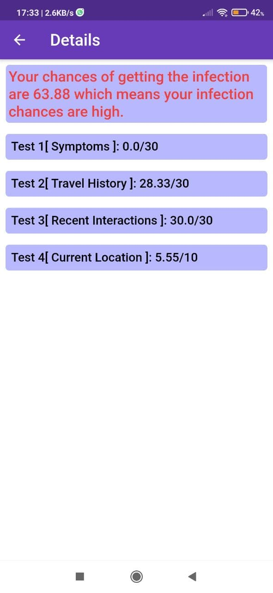

[](https://shields.io/)
[](https://shields.io/)
[](https://shields.io/)
[](https://shields.io/)
[](https://github.com/ellerbrock/open-source-badges/)

# Inffecto : lets fight COVID
## Brief
Inffecto aims to provide support to users in the lockdown period. During these difficult times, maintaining habits is not an easy task. A lot of people feel insecure about their health and daily routines. It proivdes support to them and helps them in maintaining their daily habits. It also provides a score which tells how vulnerable they are to virus.

## Features/Components
### Dashboard 
 - 
 - Central place in the application
 - Different features can be accessed

### My Account 
 - 
 - Account-related details of users 
   - name, email, profile picture. 
 - Share via link
 - Log out

### Helpline Contacts
 - 
 - Storing emergency contacts
 - User can select the state
 - Redirection to Phone app

### Health Reminders
 - 
 - Reminders about handwash, mask
 - Setting reminders for daily habits

### Safety Test
 -    
 - Relative ranking
   - Current symptoms
   - Travel history
   - Interaction with patients
   - Current location 

## Technology used:
 - [**Flutter**](https://flutter.dev/): 
We have used flutter for a lot of reasons. First is, you can make native android apps using it and have the control on each pixel on the screen. It is also very handy for handling complex user gestures on the screen. But the biggest reason for using flutter is that the application is not limited to the android platform and can be easily extended to iOS and Web via the same base code. 
 - [**Firebase**](https://firebase.google.com/): 
For handling several user information requests from authentication to data storage, we have used firebase which provides several read, write, and search queries for the different tasks for the user. 
 - [**Pub Packages**](https://pub.dev/): 
There are several pub packages we have used to provide a wide range of features to users. These are a part of flutter itself and they can be integrated with the project very easily. 
 - [**Covid19India.org API**](https://api.covid19india.org/): 
For calculating the safety rating, we require the coronavirus number data. Here the open-source API has proven its worth, as it provides daily updated statewide coronavirus number information in India.

## Learnings
 - Understanding concepts in flutter app development.
 - Handling backend operations.
 - Integrating APIs in dart
 - User friendly behavior of android apps

## Future Expansion Plans:
 - Further expanded to iOS and web platforms
 - a global API can be connected for worldwide users


## Deploying in local machine
For running Inffecto on your virtual device:
```flutter run```
